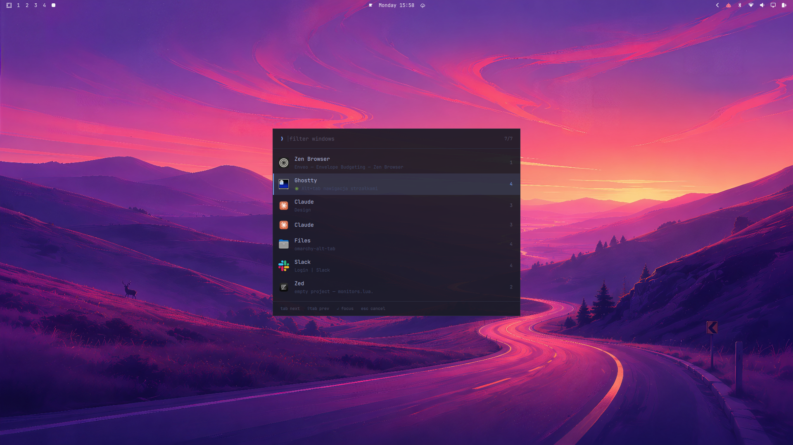
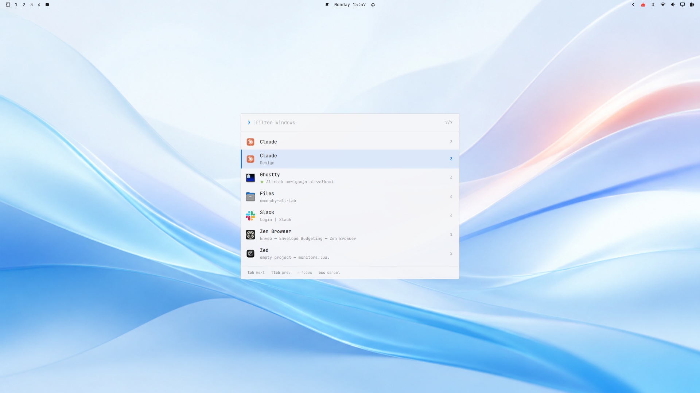

# Alt-Tab Switcher for Omarchy

A macOS-style Alt-Tab window switcher, running inside the Omarchy shell
(`omarchy-shell`) as a plugin — no extra processes, no extra dependencies.

| Tokyo Night | macOS Light |
|---|---|
|  |  |

The switcher takes its colors from whatever Omarchy theme is active — the
shots above are the stock Tokyo Night and macOS Light, untouched.

- **MRU order** — windows listed by most-recently-used; the first `Alt+Tab`
  selects your previous window, exactly like macOS / Windows.
- **Release Alt to switch** — hold Alt and cycle with Tab; releasing Alt
  focuses the selection. A quick tap switches to the previous window without
  the switcher ever appearing.
- **Type to filter** — just start typing while the switcher is open; it
  latches into sticky mode (Enter focuses, Escape cancels).
- **Theme-native** — the palette maps live onto your active Omarchy theme
  (background / foreground / accent / muted from `colors.toml`). Light and
  dark themes both work; nothing is hard-coded.
- **Two looks** — `two-line` (default: app icon, window title on its own
  line, key-hint footer) and `bare` (compact rows with `alt+<n>` jump
  numbers that focus a window directly).

## Install

```bash
omarchy plugin add https://github.com/luwojtaszek/omarchy-alt-tab.git --enable
```

## Update

```bash
omarchy plugin update io.github.luwojtaszek.alt-tab
```

## Remove

```bash
omarchy plugin remove io.github.luwojtaszek.alt-tab
```

Nothing is left behind. The plugin never writes to your Hyprland config:
its keybindings are registered dynamically at runtime, so they are gone
with the next config reload (`hyprctl reload`, or your next login). The
only file it can read, `~/.config/omarchy/alt-tab.json`, is one you
create yourself — delete it if you made one. If you bound the switcher by
hand in your own Hyprland config, remove those lines too.

To keep the plugin but stop it from touching your keymap, disable it with
`omarchy plugin disable io.github.luwojtaszek.alt-tab`, or set
`{"autoBinds": false}` (see below).

## Keybindings

**They work out of the box.** A small service inside the plugin registers
these bindings when the shell starts (and re-registers them after every
Hyprland config reload):

| Combo | Action |
|---|---|
| `Alt+Tab` / `Alt+Shift+Tab` | switch windows (MRU) |
| ``Alt+` `` / ``Alt+Shift+` `` | switch windows of the same app |
| ``Ctrl+Alt+` `` / ``Ctrl+Alt+Shift+` `` | switch windows on the current workspace |

The service is polite about it, per combo: a combo you bound yourself in
your Hyprland config is left alone (your bind wins); only unbound combos
and the stock Omarchy `Alt+Tab` cycle binds are taken over.

### Making them yours

Everything is steered from `~/.config/omarchy/alt-tab.json`.

**Another modifier** — the whole default set on `Super` instead of `Alt`
(the switcher then commits on the `Super` release, so this stays a
hold-and-cycle switcher):

```json
{ "modifier": "SUPER" }
```

Naming another modifier is treated as a deliberate choice, so those combos
are taken over even if Omarchy had something on them (stock `Super+Tab` is
"Next workspace").

If you have swapped left Alt and left Super to put Command under your thumb
(`input:kb_options = altwin:swap_lalt_lwin`), `"modifier": "SUPER"` is what
turns this into a real `Cmd+Tab`. The swap needs no further configuration
here: the switcher only ever sees logical keys, which is what the swap
already gives it.

**Your own combos** — replaces the defaults entirely. Each entry takes a
`combo`, an optional `payload` (same keys as the summon payload below)
and an optional `description`:

```json
{
  "binds": [
    { "combo": "SUPER + TAB", "payload": { "dir": "next" } },
    { "combo": "SUPER + SHIFT + TAB", "payload": { "dir": "prev" } },
    { "combo": "SUPER + GRAVE", "payload": { "dir": "next", "mode": "sameclass" } },
    { "combo": "CTRL + ALT + TAB", "payload": { "dir": "next", "mode": "sameworkspace" } }
  ]
}
```

A combo you list here is always registered — asking for it in this file
is your decision, so it takes over whatever was on that combo. Any
modifier combination and any key Hyprland accepts will do.

One rule follows from how the switcher works: it commits the selection
when you *release* the modifier, so the combo has to hold `Alt` or
`Super`, and the payload's `modifier` must name the one you used. For a
combo that holds neither — a function key, say — set `"modifier": "none"`
and the switcher behaves as a picker instead: it opens immediately and
stays up until `Enter` or `Escape`.

```json
{
  "binds": [
    { "combo": "SUPER + TAB", "payload": { "dir": "next", "modifier": "super" } },
    { "combo": "CTRL + F1",   "payload": { "dir": "next", "modifier": "none" },
      "description": "Window picker" }
  ]
}
```

**No automatic binds at all** — bind the switcher yourself in your
Hyprland config:

```json
{ "autoBinds": false }
```

Binding it by hand works too, with or without `autoBinds`: your Hyprland
config always wins over the defaults. Omarchy (Lua config):

```lua
o.bind("ALT + TAB", "Window switcher",
  "omarchy-shell shell summon io.github.luwojtaszek.alt-tab '{\"dir\":\"next\"}'")
o.bind("ALT + SHIFT + TAB", "Window switcher (back)",
  "omarchy-shell shell summon io.github.luwojtaszek.alt-tab '{\"dir\":\"prev\"}'")
```

Classic Hyprland config syntax:

```ini
bind = ALT, Tab, exec, omarchy-shell shell summon io.github.luwojtaszek.alt-tab '{"dir":"next"}'
bind = ALT SHIFT, Tab, exec, omarchy-shell shell summon io.github.luwojtaszek.alt-tab '{"dir":"prev"}'
```

## Keys (while open)

| Key | Action |
|---|---|
| `Alt+Tab` / `Tab` / `↓` / `` ` `` | next window |
| `Alt+Shift+Tab` / `⇧Tab` / `↑` | previous window |
| release `Alt` | focus selection (unless you typed a filter) |
| type text | filter windows; switcher stays open |
| `1`–`9` | focus the n-th row directly (`bare` variant) |
| `↵` | focus selection |
| `Esc` / click outside | cancel |

## Options

Options are passed in the summon payload:

| Key | Values | Default | |
|---|---|---|---|
| `dir` | `next`, `prev` | `next` | initial / repeated cycle direction |
| `variant` | `two-line`, `bare` | `two-line` | visual style |
| `mode` | `all`, `sameclass`, `sameworkspace` | `all` | which windows to list |
| `modifier` | `alt`, `super`, `none` | `alt` | which key's release commits; `none` = picker, Enter/Escape only |
| `hold` | `true`, `false` | `false` | stay open regardless of the Alt state (screenshots, demos, debugging) |

`sameclass` lists only windows of the active window's app — bind it to
``Alt+` `` for the macOS ``Cmd+` `` feel. `sameworkspace` lists only the
active window's workspace. The mode is locked in by the summon that opens
the switcher; repeated summons just cycle.

```lua
o.bind("ALT + GRAVE", "Same-app switcher",
  "omarchy-shell shell summon io.github.luwojtaszek.alt-tab '{\"dir\":\"next\",\"mode\":\"sameclass\"}'")
```

Example — the `bare` variant:

```
omarchy-shell shell summon io.github.luwojtaszek.alt-tab '{"dir":"next","variant":"bare"}'
```

## How it works, dependencies, privileges

The switcher is a `menu`-kind plugin: a fullscreen layer surface with
exclusive keyboard focus, summoned into the long-running `omarchy-shell`
process. Repeated `Alt+Tab` presses arrive as repeated summons (the Hyprland
bind consumes the key) and cycle the selection; the Alt release reaches the
focused surface as an ordinary key event.

- Window list: `hyprctl -j clients`, sorted by `focusHistoryID`.
- Focusing: Hyprland `focuswindow` dispatch. Both classic and Lua-config
  Hyprland dispatch syntax are supported (probed once at startup).
- No daemons, no root, no packages to install. Runs unsandboxed inside the
  shell process with your user permissions, like every Omarchy shell plugin.
- Uses only what Omarchy already ships: `hyprctl`, `jq` and `logger` (the
  last two solely for the keybinding service).
- Committing on release needs no raw input access: the panel is mapped the
  moment the switcher opens and takes exclusive keyboard focus, so the
  modifier release arrives as an ordinary Qt key event. In the rare case
  where a release lands in the few milliseconds before that focus is granted
  it is simply lost, and the switcher stays up until `Enter` or `Escape`.
  Reading evdev to close that gap would mean membership in the `input` group,
  which lets any process of yours read every keystroke on the machine; no
  window switcher is worth that.
- Typography follows the Omarchy brand font: JetBrains Mono. With only the
  stock `ttf-jetbrains-mono-nerd-basic` installed the Light/Medium weights
  render as Regular; install `ttf-jetbrains-mono` for the full effect.

## License

MIT
